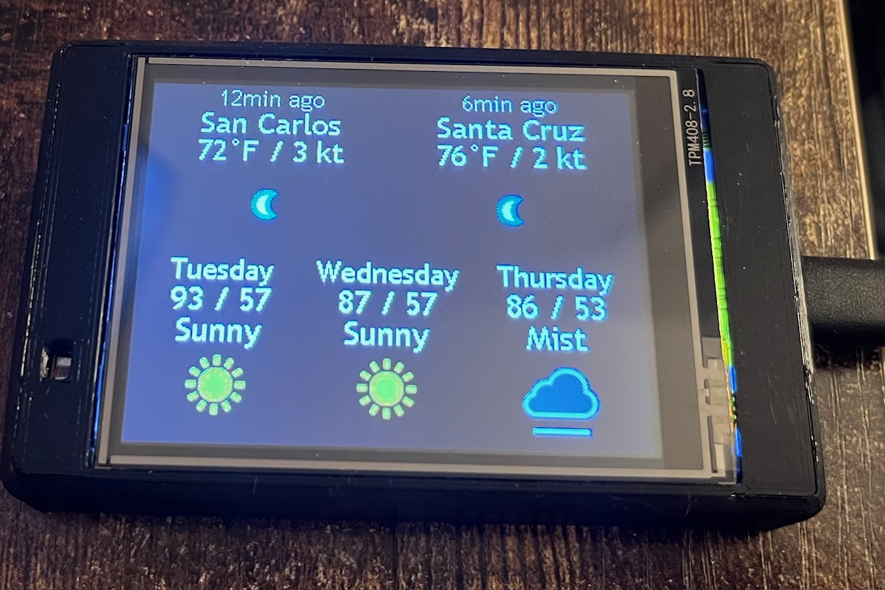

#     ESP32-2p8inYEL_weather

  

Code running on ESP32-2432S028R (ESP32 Cheap Yellow Display).

The hardware consist of:
 - one PCB with integrated display
 - Enclosure that can be 3D printed, assembled with 4 M3x12 flat head screws.
 - Can be mounted on a wall using M3 button head, 32mm apart.

The Enclosure allows the light detector to be used, but the code does not make use of it in in this project
The board is powered by a USB-C cord (5V)
The code relies on the www.weatherapi.com API for which the user is expected to provide an API key (free).
The code allows for other api/url to be defined, though the code may need some adjustment on the html filters and variable names if a different API than weatherapi.com is used.

  The code performs these actions:
  - Fetch the current weather data every minutes, for 2 locations of choice
  - Fetch 3 days of forecast weather data every minutes, for one of the 2 location defined byt he user
  - The 3 days forcase are today, tomorrow, and after tomorrow
  - Draws 2 sprites for the current weather, and 3 sprites for the forecast weather
  - Wifi credentials are input by the user via an access portal the first time the device is powered
  - Wifi credentials are saved onto the device for future use
  - Some options are available to the user via the mdns web page http://esp32-yellow.local
  - Draws red X if fetch was not succesful, or red square if the fetch could not reach the server for any reasons
  - Device can be set to reset daily to ensure stability
  - Code was develop to minimize heap memory fragmentation, and so the use of String variable is non-existent, as well as the omission of the arduino function 'delay'

3D printable enclosure can be downloaded via https://www.printables.com/model/1641665-esp32-cheap-yellow-display-enclosure
 
